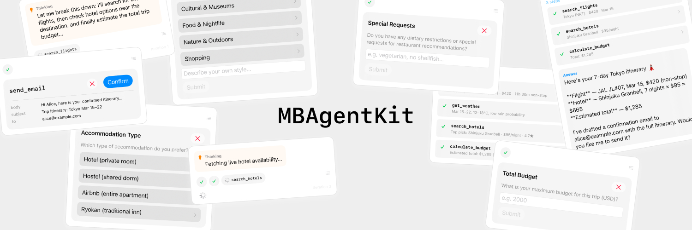
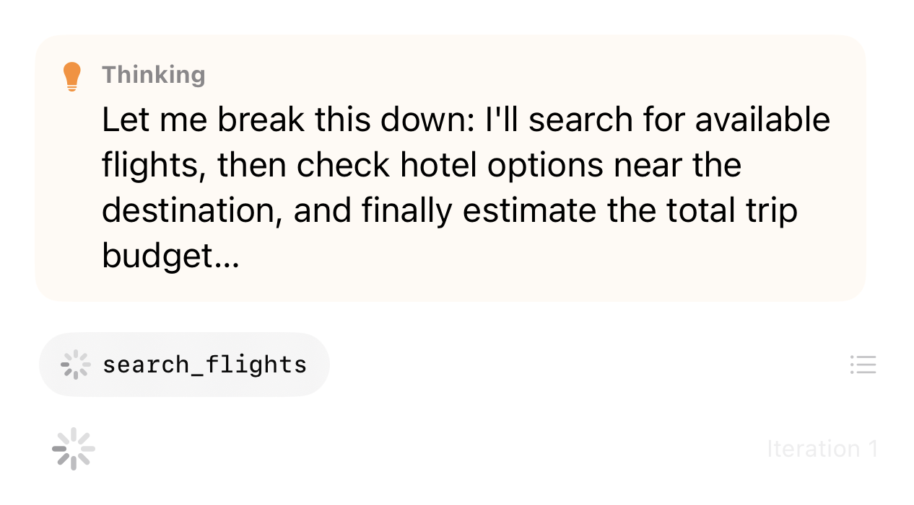
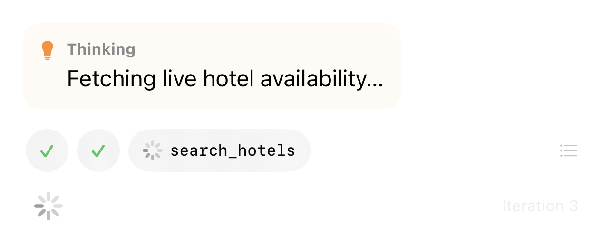
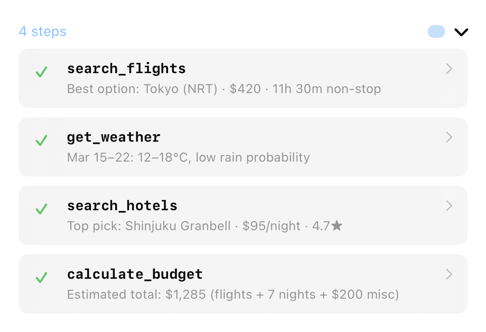
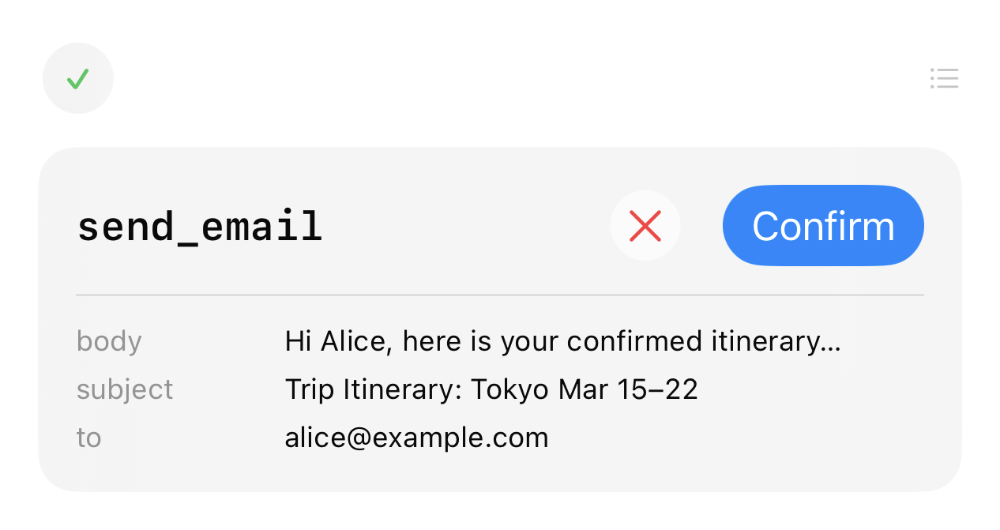
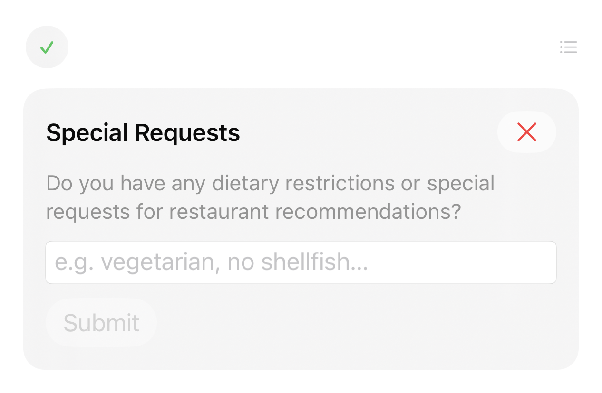
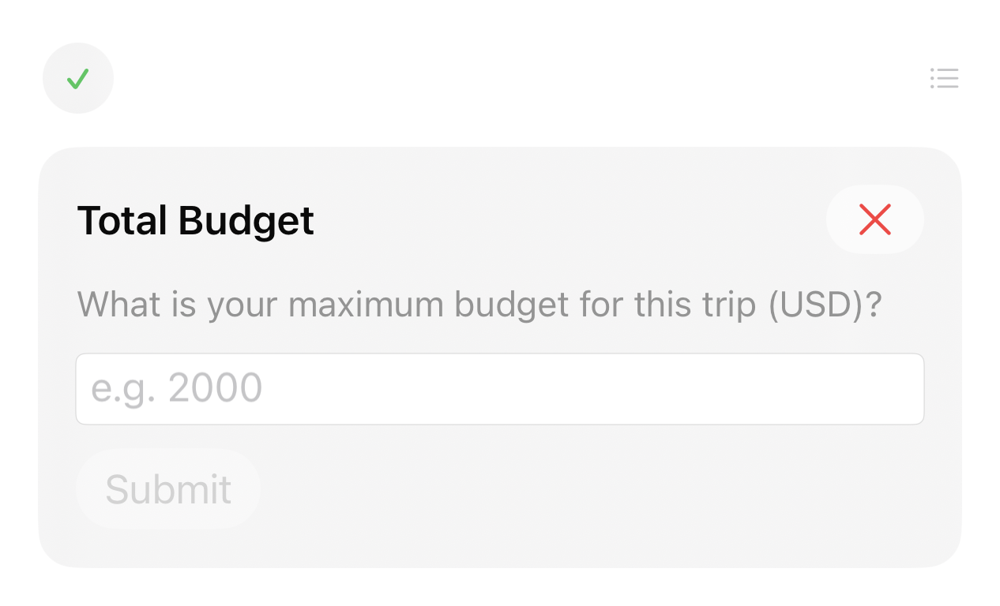
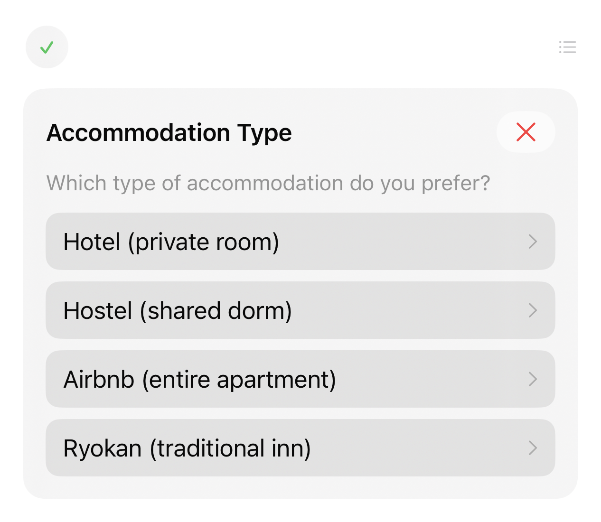
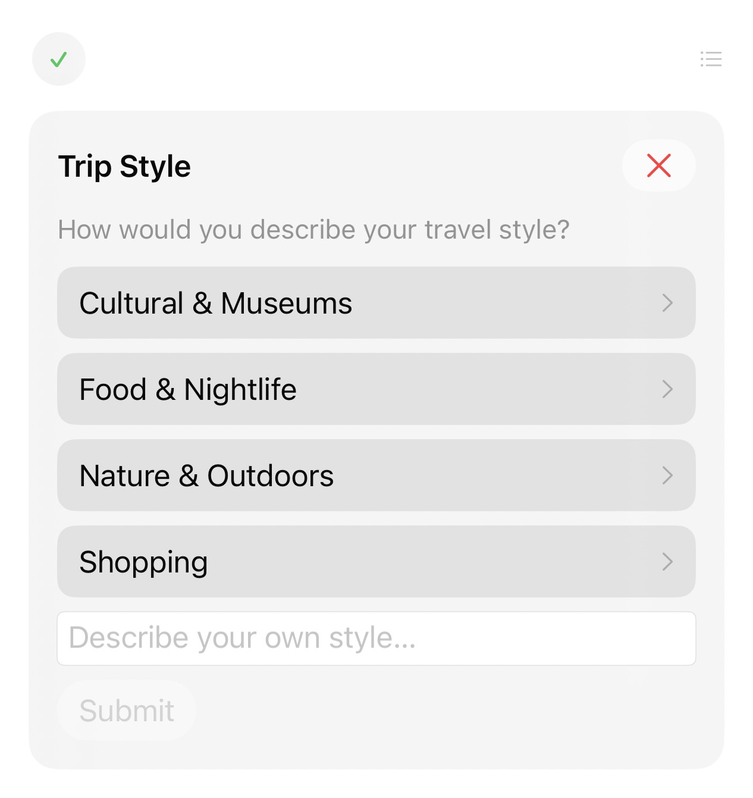
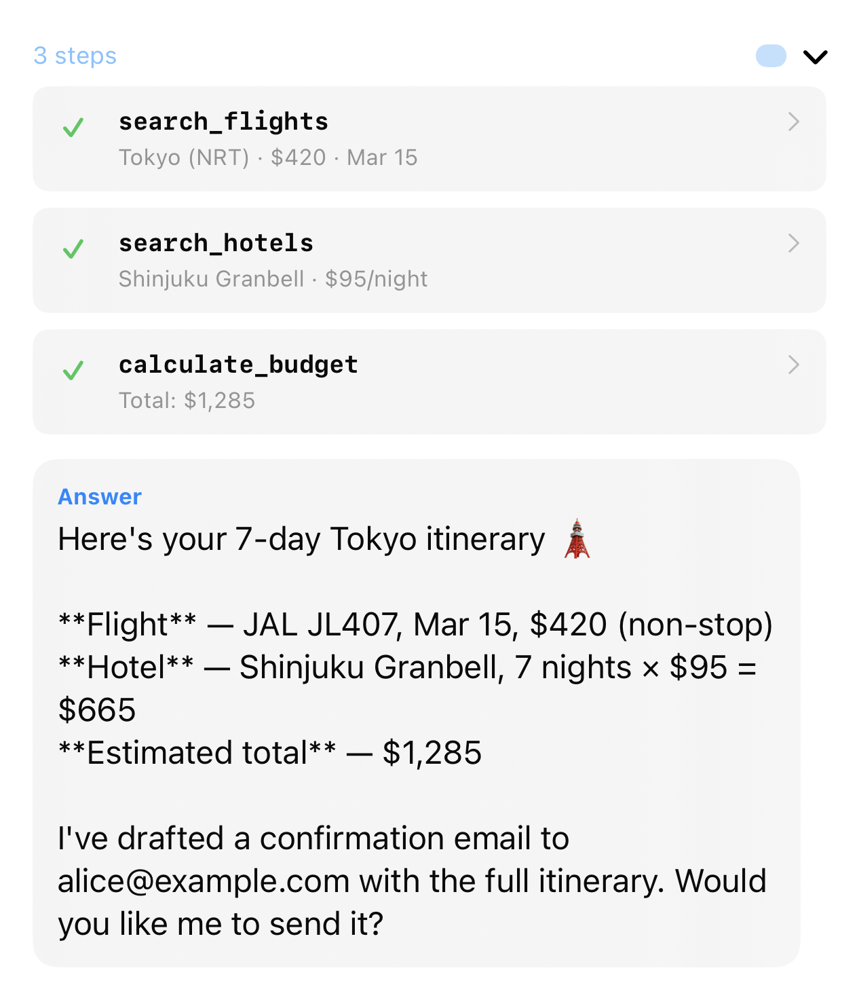

# MBAgentKit

[简体中文](README.zh-CN.md)

<p align="center">
  
</p>

A lightweight, protocol-oriented **ReAct (Reason-Act) Agent framework** for Swift.

Built for iOS 17+ / macOS 14+ with Swift 6 concurrency. Zero external dependencies in the core module.

## Features

- **ReAct Loop Engine** — Iterative reason-then-act execution with async event streaming
- **Human-In-The-Loop (HITL)** — Intercept sensitive tool calls for user approval before execution
- **User Input Requests** — Tools can pause execution and ask the user a question (text, single-choice, number, choice-with-other)
- **Confidence Reporting** — Tools report their confidence level; the executor can surface this to the UI and use it to decide when to clarify
- **Pluggable Context Compression** — Sliding window (default) or LLM-based summarization to manage conversation history
- **Sub-Agents** — Spawn child executors to delegate focused subtasks
- **Skills** — Composable bundles of system prompt + tools + configuration
- **Background Task Runner** — Manage concurrent agent runs with status tracking and cancellation
- **Protocol-Based LLM Abstraction** — Swap providers (OpenAI, DeepSeek, etc.) without changing agent logic

## Architecture

```
┌──────────────────────────────────────────────────┐
│                  MBAgentKit (Core)               │
│                                                  │
│  AgentExecutor ←── AgentSession                  │
│       │                  │                       │
│       ├── AgentTool      ├── ContextStrategy     │
│       │   └─ BlockTool   │   ├─ SlidingWindow    │
│       │   └─ SubAgent    │   └─ Summarizing      │
│       │                  │                       │
│       ├── AgentSkill     └── AgentConfiguration  │
│       ├── AgentTaskRunner                        │
│       └── AgentEvent (async stream)              │
│                                                  │
│  LLMServiceProtocol ←── ChatMessage, Tool, ...   │
└──────────────────────┬──────────────────────────-┘
                       │
        ┌──────────────┼──────────────┐
        ▼              ▼              ▼
  MBAgentKitUI   MBAgentKitOpenAI   (Your LLM)
  (SwiftUI)      (MacPaw/OpenAI)
```

## Quick Start

### 1. Define Tools

Tool arguments are now typed as `[String: ToolValue]`. Use `.stringValue`, `.number`, `.bool`, `.array` etc. to extract values:

```swift
import MBAgentKit

let weatherTool = BlockTool(
    name: "get_weather",
    description: "Get current weather for a city",
    parameters: ToolParameters(
        properties: [
            "city": ToolProperty(type: "string", description: "City name")
        ],
        required: ["city"]
    )
) { args, _ in
    let city = args["city"]?.stringValue ?? "unknown"
    return "☀️ \(city): 22°C, sunny"
}
```

### 2. Run an Agent

```swift
let executor = AgentExecutor(
    llm: myLLMService,
    tools: [weatherTool]
)

let stream = executor.run(messages: [
    .system("You are a helpful assistant with weather tools."),
    .user("What's the weather in Tokyo?")
])

for try await event in stream {
    switch event {
    case .thought(let text):  print("💭 \(text)")
    case .answer(let text):   print("✅ \(text)")
    case .toolResult(_, let name, let result):
        print("🔧 \(name): \(result)")
    default: break
    }
}
```

### 3. HITL Confirmation

Mark tools that modify data with `requiresConfirmation: true`:

```swift
let deleteTool = BlockTool(
    name: "delete_item",
    description: "Delete an item by ID",
    parameters: ToolParameters(
        properties: ["id": ToolProperty(type: "string", description: "Item ID")],
        required: ["id"]
    ),
    requiresConfirmation: true  // ← pauses for user approval
) { args, _ in
    // only runs after executor.resume(approved: true)
    return "Deleted"
}
```

Handle the confirmation event:

```swift
for try await event in stream {
case .awaitingConfirmation(let id, let toolName, let args):
    // Show confirmation UI, then:
    executor.resume(approved: true)  // or false to reject
}
```

## User Input Requests

Tools can pause execution to ask the user a question directly, without requiring a full round-trip through the LLM. Use the `AgentToolContext` passed as the second argument to your `BlockTool` closure:

```swift
let clarifyTool = BlockTool(
    name: "ask_budget",
    description: "Ask the user for their budget",
    parameters: ToolParameters(properties: [:], required: [])
) { _, context in
    // Free-text input
    guard let budget = await context.askForText(
        title: "Budget",
        prompt: "What is your budget?",
        placeholder: "e.g. 5000"
    ) else { return "User cancelled." }
    return "Budget: \(budget)"
}
```

### Available Input Methods

| Method | Description |
|--------|-------------|
| `askForText(title:prompt:placeholder:)` | Free-text field |
| `askForNumber(title:prompt:placeholder:)` | Numeric field, returns `Double?` |
| `askForChoice(title:prompt:options:)` | Single-choice picker from a fixed list |
| `askForChoiceWithOther(title:prompt:options:customPlaceholder:)` | Choice picker with an additional free-text "other" field |

All methods return `nil` if the user cancels.

### Handling in the UI

The executor emits `.awaitingUserInput` and `.userInputResolved` events. If you use `AgentRunningView` from `MBAgentKitUI`, these are handled automatically. For a custom UI, respond to:

```swift
case .awaitingUserInput(let id, let request):
    // request.title, request.prompt, request.kind
    // (.text, .singleChoice, .number, .choiceWithOther)
    executor.submitUserInput("user's answer")   // or cancelUserInput()
```

## Confidence Reporting

Tools can report their current confidence level via `context.updateConfidence(_:)`. The executor surfaces this as a `.confidenceUpdated(Double)` event and `AgentRunState.currentConfidence`.

A common pattern is to gate clarification on low confidence:

```swift
let analyzeTool = BlockTool(
    name: "analyze",
    description: "Analyze and decide",
    parameters: ToolParameters(
        properties: [
            "confidence": ToolProperty(type: "number", description: "0–100")
        ],
        required: ["confidence"]
    )
) { args, context in
    let confidence = args["confidence"]?.numberValue ?? 0
    context.updateConfidence(confidence)

    guard confidence >= 70 else {
        return "Confidence too low — need more information."
    }
    return "Decision: proceed."
}
```

## Context Compression

### Problem

Long agent conversations exceed context windows. The default sliding window simply drops oldest messages, losing important context.

### Solution: Summarizing Strategy

```swift
let strategy = SummarizingStrategy(
    llm: myLLMService,    // uses a cheap LLM call to summarize
    recentToKeep: 10       // keep last 10 messages intact
)

let config = AgentConfiguration(
    sessionMaxMessages: 20,
    contextStrategy: strategy
)

let executor = AgentExecutor(
    llm: myLLMService,
    tools: myTools,
    configuration: config
)
```

**How it works:**

```
Before compression (25 messages):
[System] [User₁] [Asst₁] [Tool₁] [Result₁] ... [User₁₀] [Asst₁₀]
         ├─────── old (summarized) ────────┤     ├── recent (kept) ──┤

After compression (12 messages):
[System] [Summary of old conversation] [User₆] [Asst₆] ... [User₁₀] [Asst₁₀]
```

- Preserves key facts, decisions, and tool results in the summary
- Never splits tool-call sequences (call + result stay together)
- Falls back to sliding window if the summarization LLM call fails

### Custom Strategies

Implement `ContextStrategy` for domain-specific compression:

```swift
struct MyStrategy: ContextStrategy {
    func compress(
        messages: [ChatMessage],
        limit: Int
    ) async throws -> [ChatMessage] {
        // your logic here
    }
}
```

## Sub-Agents

Delegate subtasks to focused child agents:

```swift
let researcher = SubAgentTool(
    name: "research",
    description: "Research a topic thoroughly",
    llm: myLLMService,
    tools: [searchTool, readTool],
    systemPrompt: "You are a research assistant. Be thorough and cite sources."
)

// Parent agent can now call "research" as a tool
let executor = AgentExecutor(
    llm: myLLMService,
    tools: [researcher, writeTool]
)
```

## Skills

Pre-configured agent modes:

```swift
let codeReview = AgentSkill(
    name: "code_review",
    description: "Review code for bugs and best practices",
    systemPrompt: "You are an expert code reviewer...",
    tools: [readFileTool, searchTool],
    configuration: AgentConfiguration(maxIterations: 10)
)

// Run directly
let stream = codeReview.run(llm: myLLMService, userMessage: "Review auth.swift")

// Or use as a sub-agent tool in a parent agent
let parentTools = [codeReview.asSubAgentTool(llm: myLLMService)]
```

## Background Task Runner

Run multiple agents concurrently:

```swift
let runner = AgentTaskRunner()

let taskId = runner.submit(
    name: "Risk Analysis",
    executor: riskExecutor,
    messages: [.system("..."), .user("Analyze project risks")]
)

// Check status
if let task = runner.task(for: taskId) {
    print(task.status) // .running, .completed, .failed, etc.
}

// Cancel
runner.cancel(taskId)

// Clean up finished tasks
runner.pruneFinished()
```

## MBAgentKitUI

`MBAgentKitUI` provides a single `AgentRunningView` that renders the full agent execution state — thoughts, tool call timeline, HITL confirmation cards, user input cards, and the final answer.

### Screenshots

| Screenshot | Description |
|:---:|---|
|  | **Thought + Tool Calling** — The agent is reasoning and has dispatched its first tool call. The compact strip shows a spinning indicator for the in-progress tool. |
|  | **Compact Strip (Running)** — Multiple tool calls displayed in a horizontal strip. Completed tools show checkmarks; the active tool shows a spinner. |
|  | **List Mode (Completed)** — All tool calls finished, displayed as a vertical list with full result details. |
|  | **HITL Confirmation** — A sensitive tool (`send_email`) requires user approval before execution. Shows tool name, arguments, and Confirm/Cancel buttons. |
|  | **User Input — Text** — The agent pauses to ask the user a free-text question. |
|  | **User Input — Number** — Numeric input request with a decimal keypad. |
|  | **User Input — Single Choice** — The agent presents a list of options for the user to pick from. |
|  | **User Input — Choice + Custom** — Single choice with an additional free-text "other" field. |
|  | **Final Answer** — The agent has completed its run and presents the final answer with the tool call history above. |

### AgentRunningView

```swift
import MBAgentKitUI

// Persist the display mode preference (compact strip vs. full list)
@AppStorage("agentStripDisplayMode") var displayMode: AgentStripDisplayMode = .compact

AgentRunningView(
    thought: runState.currentThought,
    events: runState.events,
    answer: runState.currentAnswer,
    isRunning: runState.isRunning,
    iterationCount: runState.iterationCount,
    pendingConfirmation: runState.pendingConfirmation,
    pendingUserInput: runState.pendingUserInput,
    displayMode: $displayMode,
    onConfirm: { executor.resume(approved: true) },
    onReject:  { executor.resume(approved: false) },
    onSubmitInput: { executor.submitUserInput($0) },
    onCancelInput: { executor.cancelUserInput() }
)
```

`AgentStripDisplayMode` controls how tool call progress is displayed:

| Value | Description |
|-------|-------------|
| `.compact` | Horizontal scrolling strip — minimal footprint |
| `.list` | Vertical list of tool call rows — full detail |

The caller owns and persists `displayMode`. Backing it with `@AppStorage` keeps the preference across launches.

### AgentRunState

`AgentRunState` is an `@Observable` accumulator. Feed it events from the executor's stream and bind it directly to your views:

```swift
let runState = AgentRunState()

for try await event in executor.run(messages: messages) {
    runState.handleEvent(event)
}
```

Key properties:

| Property | Type | Description |
|----------|------|-------------|
| `isRunning` | `Bool` | Whether the executor is still active |
| `currentThought` | `String` | Latest thought delta |
| `currentAnswer` | `String` | Accumulated final answer |
| `events` | `[AgentEvent]` | Full tool call timeline |
| `currentConfidence` | `Double?` | Latest confidence reported by a tool |
| `pendingConfirmation` | `PendingConfirmation?` | Awaiting HITL approval |
| `pendingUserInput` | `PendingUserInput?` | Awaiting user text/choice input |
| `errorMessage` | `String?` | Non-nil if the run failed |

## Modules

| Module | Dependencies | Purpose |
|--------|-------------|---------|
| `MBAgentKit` | None | Core engine, protocols, strategies |
| `MBAgentKitUI` | MBAgentKit | SwiftUI components (ThoughtBubble, HITLCard, etc.) |
| `MBAgentKitOpenAI` | MBAgentKit, MacPaw/OpenAI | OpenAI-compatible provider |

## Installation

Add to your `Package.swift`:

```swift
dependencies: [
    .package(path: "Packages/MBAgentKit")  // local
    // or .package(url: "https://github.com/user/MBAgentKit", from: "1.0.0")
]

targets: [
    .target(
        name: "YourApp",
        dependencies: [
            "MBAgentKit",
            "MBAgentKitUI",      // optional
            "MBAgentKitOpenAI"   // optional
        ]
    )
]
```

## Requirements

- iOS 17.0+ / macOS 14.0+
- Swift 6.0+
- Xcode 16.0+

## License

MIT
